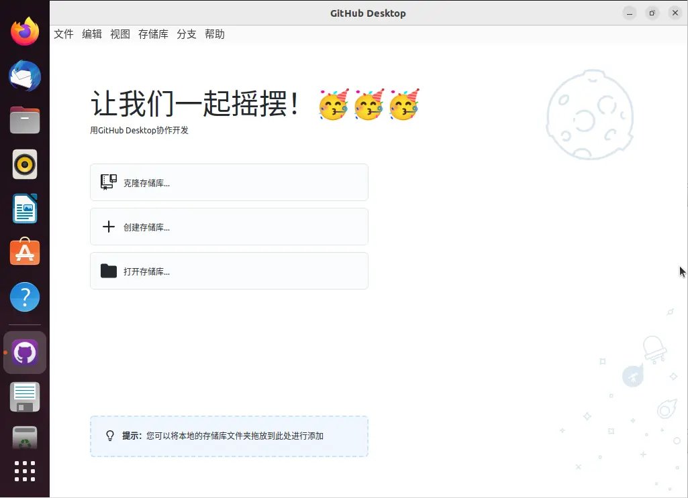
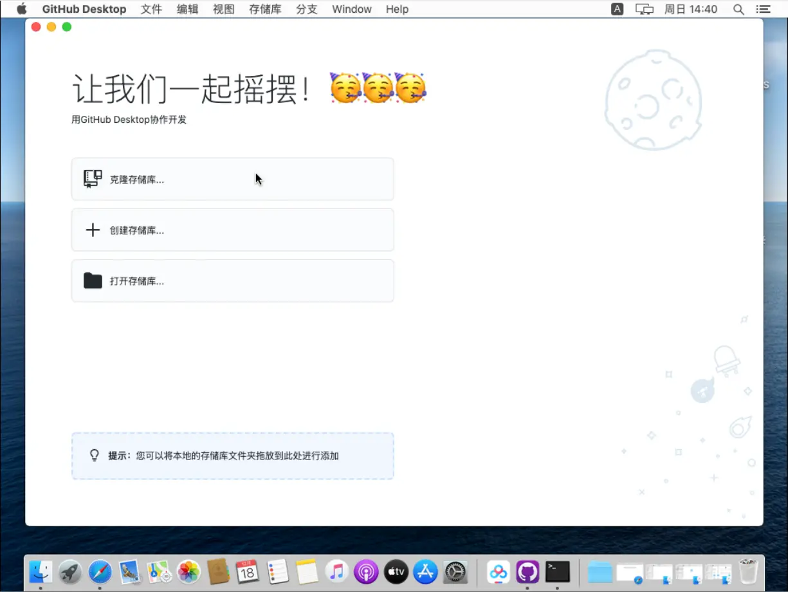
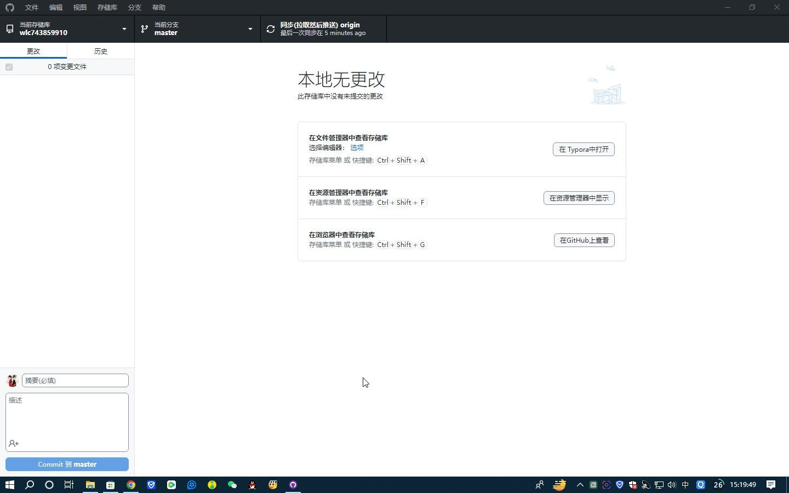
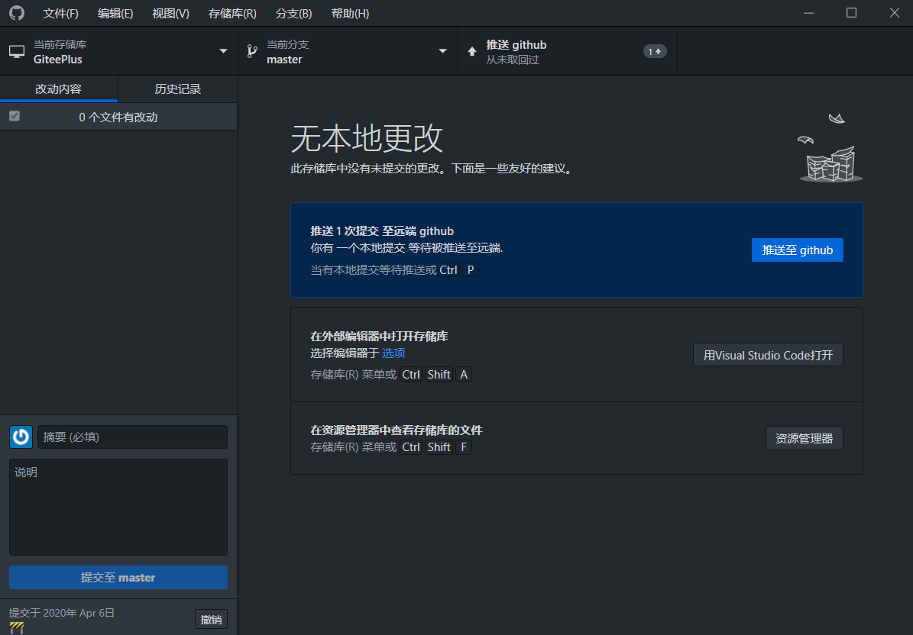

# GitHub_Desktop_Simplified_Chinese

---

<b>GitHub Desktop</b>

<b>专注于重要的事情，而不是与Git斗争。无论您是Git新手还是经验丰富的用户，GitHub Desktop都可以简化您的开发工作流程。</b>

 

---

GitHub Desktop 官网：https://desktop.github.com

GitHub Desktop 仓库：https://github.com/desktop/desktop

GitHub Desktop 发行版：https://github.com/desktop/desktop/releases/latest

GitHub Desktop 发行说明：https://desktop.github.com/release-notes

GitHub Desktop 客户端下载：| [Linux](https://github.com/shiftkey/desktop/releases/latest) | [MacOS](https://central.github.com/deployments/desktop/desktop/latest/darwin) | [Windows](https://central.github.com/deployments/desktop/desktop/latest/win32) | 

GitHub Desktop 客户端仓库下载：| [Linux](https://github.com/shiftkey/desktop/releases/latest) | [MacOS](https://github.com/desktop/desktop/releases/latest/download/GitHub.Desktop-x64.zip) | [Windows](https://github.com/desktop/desktop/releases/latest/download/GitHubDesktopSetup-x64.exe) | 

GitHub Desktop 版本：| 3.2.1 - 3.4.19 | 

GitHub Desktop 汉化补丁包 版本：| 3.2.1 - 3.4.19 | 

---

# 注意：
请一定要保持Github Desktop版本与本汉化补丁包版本对应，否则汉化后Github Desktop可能会报错或打不开。

---

# GitHub Desktop for 2025年4月23日 3.4.19 发布说明

**新的**
 - 用户可以过滤更改的文件列表 - [#20220](https://github.com/desktop/desktop/pull/20220)
 - 添加对多个企业帐户的支持 - [#20227](https://github.com/desktop/desktop/pull/20227)

**固定**
 - 右键单击选定的文件将使这些文件在更改列表中保持选中状态 - [#20319](https://github.com/desktop/desktop/issues/20319)
 - 让凭证助手提示输入给定存储库中使用的特定企业帐户 - [#20318](https://github.com/desktop/desktop/pull/20318)
 - 修复无效的令牌对话框样式 - [#20317](https://github.com/desktop/desktop/pull/20317)
 - 修复拆分差异视图中的缩进错误 - [#18800](https://github.com/desktop/desktop/issues/18800)。谢谢[@iamarjunsuresh](https://github.com/iamarjunsuresh)！
 - 从无变化屏幕打开时初始化集成设置 - [#19807](https://github.com/desktop/desktop/issues/19807)。谢谢[@iamarjunsuresh](https://github.com/iamarjunsuresh)！
 - 调整“预览拉取请求”中的文件列表大小不会打开/创建拉取请求 - [#20200](https://github.com/desktop/desktop/issues/20200)
 - 克隆对话框中的存储库列表和拉取请求列表等部分列表向屏幕阅读器公布其标签 - [#20184](https://github.com/desktop/desktop/pull/20184)
 - diff 的添加和删除前缀不会换行，使得并排 diff 中的 diff 内容宽度相等 - [#20191](https://github.com/desktop/desktop/issues/20191)
 - 在“查找”对话框中按 Ctrl+A 会选择搜索文本而不是差异内容 - [#20049](https://github.com/desktop/desktop/issues/20049)

**改进**
 - 改进默认 README 格式 - [#20161](https://github.com/desktop/desktop/issues/20161)。谢谢[@OctCarp](https://github.com/OctCarp)！
 - “您计划如何使用这个 fork？”对话框中的单选选项标签反映了它们的用途 - [#20183](https://github.com/desktop/desktop/issues/20183)
 - 创建分支、存储更改和分叉行为对话框中的单选控件具有视觉选择指示器 - [#20052](https://github.com/desktop/desktop/pull/20052)
 - 推广 GIT_CONFIG_PARAMETERS 在生产环境中的使用 - [#20198](https://github.com/desktop/desktop/pull/20198)
 - 在空白提示弹出窗口中使用默认光标而不是文本光标 - [#20153](https://github.com/desktop/desktop/pull/20153)

---

# Linux 简体中文汉化

将本仓库中Linux文件夹下的main.js和renderer.js拷贝粘贴替换本地GitHub Desktop的资源目录

本地GitHub Desktop资源目录一般为：/usr/lib/github-desktop/resources/app
     【请一定记得提前做好备份】
     
替换完成后 重新打开GitHub Desktop

完成后界面
---

---

# MacOS 简体中文汉化
将本仓库中Mac文件夹下的main.js和renderer.js拷贝粘贴替换本地GitHub Desktop的资源目录

本地GitHub Desktop资源目录一般为：/Applications/GitHub Desktop.app/Contents/Resources/app
     【请一定记得提前做好备份】
     
替换完成后 重新打开GitHub Desktop

完成后界面
---

---

# Windows 简体中文汉化
将本仓库中Windows文件夹下的main.js和renderer.js拷贝粘贴替换本地GitHub Desktop的资源目录

本地GitHub Desktop资源目录一般为：C:\Users\【用户名】\AppData\Local\GitHub Desktop\【最新版本文件夹 例：app-3.4.19】\resources\app
     【请一定记得提前做好备份】
     
替换完成后 重新打开GitHub Desktop

完成后界面
---

---

### 如果您觉得本工具对您有帮助，不妨在右上角点亮一颗小星星，以示鼓励！

---

  

  

  

  

  

---

---

昵称：我只是你的过客

个性签名：每个人都是每个人的过客

国籍：中华人民共和国 / 现居：中国湖北省武汉市

---

[MIT License](https://github.com/743859910/GitHub_Desktop_Simplified_Chinese/blob/master/LICENSE)

Copyright © 2008 - 2025 743859910. All Rights Reserved. 我只是你的过客工作室. 版权所有

---
