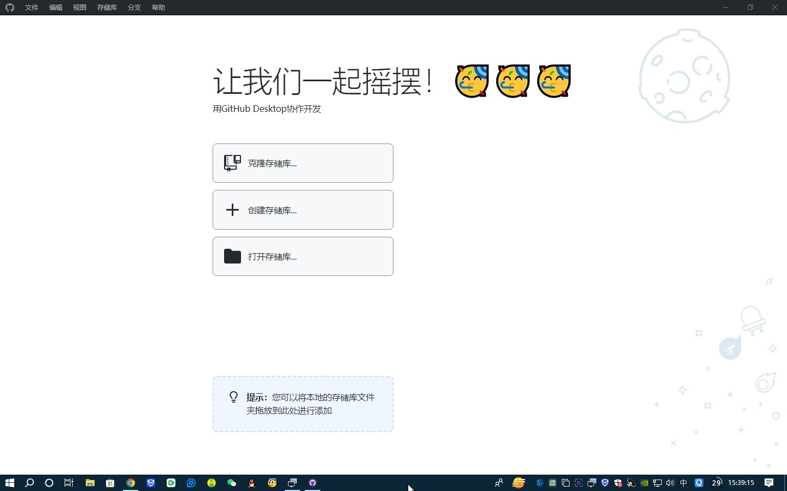

# GitHub_Desktop_Simplified_Chinese

---

<b>GitHub Desktop</b>

<b>专注于重要的事情，而不是与Git斗争。无论您是Git新手还是经验丰富的用户，GitHub Desktop都可以简化您的开发工作流程。</b>

 

---

GitHub Desktop 官网：https://desktop.github.com

GitHub Desktop 仓库：https://github.com/desktop/desktop

GitHub Desktop 发行版：https://github.com/desktop/desktop/releases/latest

GitHub Desktop 发行说明：https://desktop.github.com/release-notes

GitHub Desktop 客户端官网下载：| [Linux](https://github.com/shiftkey/desktop/releases/latest) | [MacOS](https://central.github.com/deployments/desktop/desktop/latest/darwin) | [Windows](https://central.github.com/deployments/desktop/desktop/latest/win32) | 

GitHub Desktop 客户端Releases下载：| [Linux](https://github.com/shiftkey/desktop/releases/latest) | [MacOS](https://github.com/desktop/desktop/releases/latest/download/GitHub.Desktop-x64.zip) | [Windows](https://github.com/desktop/desktop/releases/latest/download/GitHubDesktopSetup-x64.exe) | 

GitHub Desktop 版本：| 3.2.1 - 3.5.3 | 

GitHub Desktop 汉化补丁包 版本：| 3.2.1 - 3.5.3 | 

---

# 注意：
请一定要保持Github Desktop版本与本汉化补丁包版本对应，否则汉化后Github Desktop可能会报错或打不开。

---

# GitHub Desktop for 2025年10月08日 3.5.3 发布说明

**额外**
- 添加 Ptyxis shell 集成 - [#20963](https://github.com/desktop/desktop/issues/20963)。谢谢[@logonoff](https://github.com/logonoff)！

**固定的**
- 副驾驶消息生成进度消息已向屏幕阅读器公布 - [#21008](https://github.com/desktop/desktop/pull/21008)
- 修复：改善图形和文本之间的间距 - [#7500](https://github.com/desktop/desktop/issues/7500)。谢谢[@robbierotman](https://github.com/robbierotman)！
- 焦点落在冲突解决对话框中的第一个交互式控件上，而不是“继续”按钮上 - [#20880](https://github.com/desktop/desktop/pull/20880)

**改进**
- 将 Electron 升级到 v38.2.0 - [#21060](https://github.com/desktop/desktop/pull/21060)
- “文件不存在”合并冲突警告的文本颜色满足 4.5:1 对比度要求 - [#20902](https://github.com/desktop/desktop/pull/20902)
- 在单个精简的工具提示中提供列表项的工具提示，允许键盘用户和屏幕阅读器用户在导航列表项时访问 - [#20804](https://github.com/desktop/desktop/pull/20804)

---

# Linux 简体中文汉化

将本仓库中Linux文件夹下的main.js和renderer.js拷贝粘贴替换本地GitHub Desktop的资源目录

本地GitHub Desktop资源目录一般为：/usr/lib/github-desktop/resources/app
     【请一定记得提前做好备份】
     
替换完成后 重新打开GitHub Desktop

完成后界面
---

---

# MacOS 简体中文汉化
将本仓库中Mac文件夹下的main.js和renderer.js拷贝粘贴替换本地GitHub Desktop的资源目录

本地GitHub Desktop资源目录一般为：/Applications/GitHub Desktop.app/Contents/Resources/app
     【请一定记得提前做好备份】
     
替换完成后 重新打开GitHub Desktop

完成后界面
---

---

# Windows 简体中文汉化
将本仓库中Windows文件夹下的main.js和renderer.js拷贝粘贴替换本地GitHub Desktop的资源目录

本地GitHub Desktop资源目录一般为：C:\Users\【用户名】\AppData\Local\GitHub Desktop\【最新版本文件夹 例：app-3.5.3】\resources\app
     【请一定记得提前做好备份】
     
替换完成后 重新打开GitHub Desktop

完成后界面
---

---

### 如果您觉得本工具对您有帮助，不妨在右上角点亮一颗小星星，以示鼓励！

---

  

  

  

  

  

---

---

昵称：我只是你的过客

个性签名：每个人都是每个人的过客

国籍：中华人民共和国 / 现居：中国湖北省武汉市

---

[MIT License](https://github.com/743859910/GitHub_Desktop_Simplified_Chinese/blob/master/LICENSE)

Copyright © 2008 - 2025 743859910. All Rights Reserved. 我只是你的过客工作室. 版权所有

---
