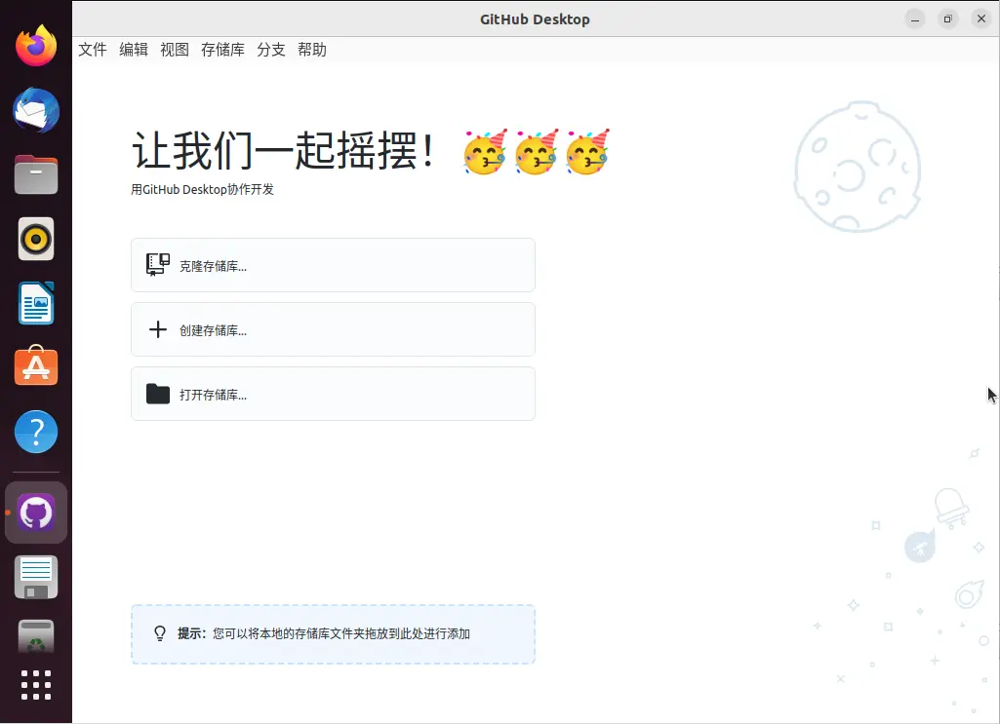
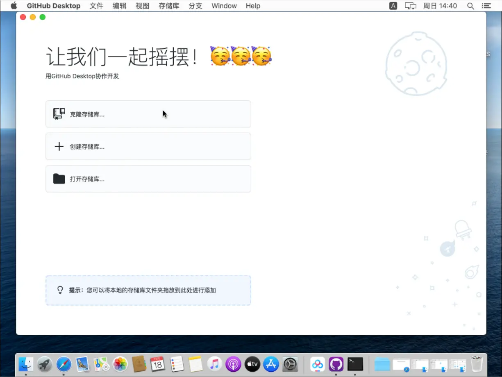
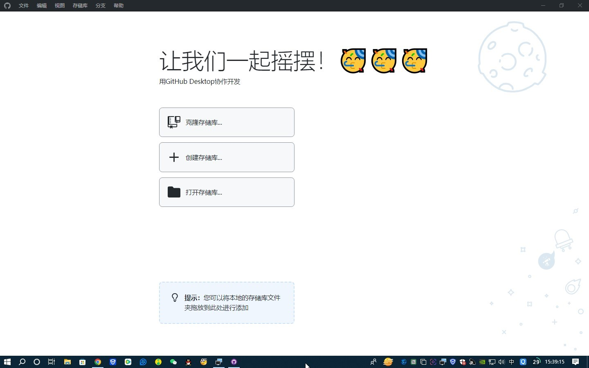
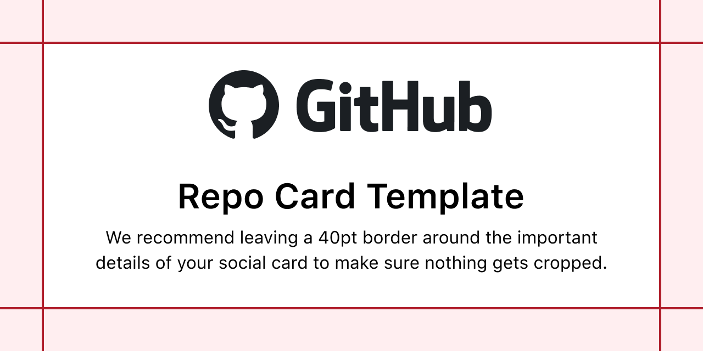

# GitHub_Desktop_Simplified_Chinese

---

<b>GitHub Desktop</b>

<b>专注于重要的事情，而不是与Git斗争。无论您是Git新手还是经验丰富的用户，GitHub Desktop都可以简化您的开发工作流程。</b>

 

---

GitHub Desktop 官网：https://desktop.github.com

GitHub Desktop 仓库：https://github.com/desktop/desktop

GitHub Desktop 发行版：https://github.com/desktop/desktop/releases/latest

GitHub Desktop 发行说明：https://desktop.github.com/release-notes

GitHub Desktop 客户端官网下载：| [Linux](https://github.com/shiftkey/desktop/releases/latest) | [MacOS](https://central.github.com/deployments/desktop/desktop/latest/darwin) | [Windows](https://central.github.com/deployments/desktop/desktop/latest/win32) | 

GitHub Desktop 客户端Releases下载：| [Linux](https://github.com/shiftkey/desktop/releases/latest) | [MacOS](https://github.com/desktop/desktop/releases/latest/download/GitHub.Desktop-x64.zip) | [Windows](https://github.com/desktop/desktop/releases/latest/download/GitHubDesktopSetup-x64.exe) | 

GitHub Desktop 版本：| 3.5.0 - 3.5.7 | 

GitHub Desktop 汉化补丁包 版本：| 3.5.0 - 3.5.7 | 

---

# 注意：

请一定要保持Github Desktop版本与本汉化补丁包版本对应，否则汉化后Github Desktop可能会报错或打不开。

---

# GitHub Desktop for 2026年04月01日 3.5.7 发布说明

**额外**
- 重命名分支对话框现在会根据存储库规则集验证分支名称 - [#21822](https://github.com/desktop/desktop/pull/21822)
- 允许通过提交选项菜单提交空提交 - [#21771](https://github.com/desktop/desktop/pull/21771)
- 为开发者原创性证书工作流程添加选项，在提交记录中包含“签名者”尾部 - [#21741](https://github.com/desktop/desktop/pull/21741)

**固定的**
- 现在即使 GitHub Desktop 窗口未获得焦点，“放弃更改”操作也能完成 - [#21739](https://github.com/desktop/desktop/pull/21739)
- 允许从空仓库获取源文件 - [#4574 ](https://github.com/desktop/desktop/issues/4574)[#4575](https://github.com/desktop/desktop/pull/4575)。谢谢。[@jackfreem](https://github.com/jackfreem)！
- 修复调整窗口大小时的背景颜色问题 - [#21548](https://github.com/desktop/desktop/issues/21548)。谢谢。[@BaldrianSector](https://github.com/BaldrianSector)！
- 忽略终端中的 Tab 键并保持文本区域启用 - [#21696](https://github.com/desktop/desktop/issues/21696)
- 在提交过程中切换到“历史记录”选项卡时，成功提交后清除提交消息 - [#21721](https://github.com/desktop/desktop/pull/21721)

**改进**
- macOS Tahoe 的 Liquid Glass 图标 - [#21010](https://github.com/desktop/desktop/issues/21010)。谢谢。[@fabe](https://github.com/fabe)和[@caiofbpa](https://github.com/caiofbpa)！
- 将默认标签页大小从 8 个字符改为 4 个字符 - [#21705](https://github.com/desktop/desktop/issues/21705)。谢谢。[@advaith1](https://github.com/advaith1)！
- 在提交归属中识别 Copilot CLI 机器人 - [#21727](https://github.com/desktop/desktop/pull/21727)

---

# Linux 简体中文汉化

将本仓库中Linux文件夹下的main.js和renderer.js拷贝粘贴替换本地GitHub Desktop的资源目录

本地GitHub Desktop资源目录一般为：/usr/lib/github-desktop/resources/app
     【请一定记得提前做好备份】
     
替换完成后 重新打开GitHub Desktop

完成后界面
---

---

# MacOS 简体中文汉化

将本仓库中Mac文件夹下的main.js和renderer.js拷贝粘贴替换本地GitHub Desktop的资源目录

本地GitHub Desktop资源目录一般为：/Applications/GitHub Desktop.app/Contents/Resources/app
     【请一定记得提前做好备份】
     
替换完成后 重新打开GitHub Desktop

完成后界面
---

---

# Windows 简体中文汉化

将本仓库中Windows文件夹下的main.js和renderer.js拷贝粘贴替换本地GitHub Desktop的资源目录

本地GitHub Desktop资源目录一般为：C:\Users\【用户名】\AppData\Local\GitHub Desktop\【最新版本文件夹 例：app-3.5.7】\resources\app
     【请一定记得提前做好备份】
     
替换完成后 重新打开GitHub Desktop

完成后界面
---

---

### 如果您觉得本工具对您有帮助，不妨在右上角点亮一颗小星星，以示鼓励！

---

  

  

  

  

  

---

昵称：我只是你的过客

个性签名：每个人都是每个人的过客

国籍：中华人民共和国 / 现居：中国湖北省武汉市

---

[MIT License](https://github.com/743859910/GitHub_Desktop_Simplified_Chinese/blob/master/LICENSE)

Copyright © 2008 - 2026 743859910. All Rights Reserved. 我只是你的过客工作室. 版权所有

---
