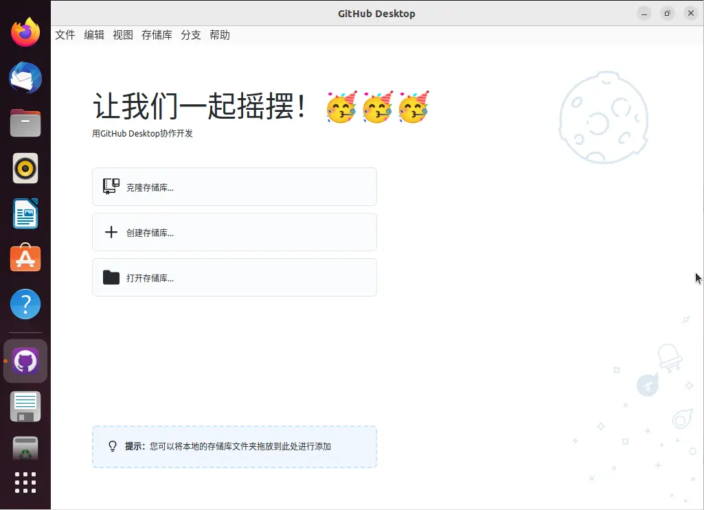
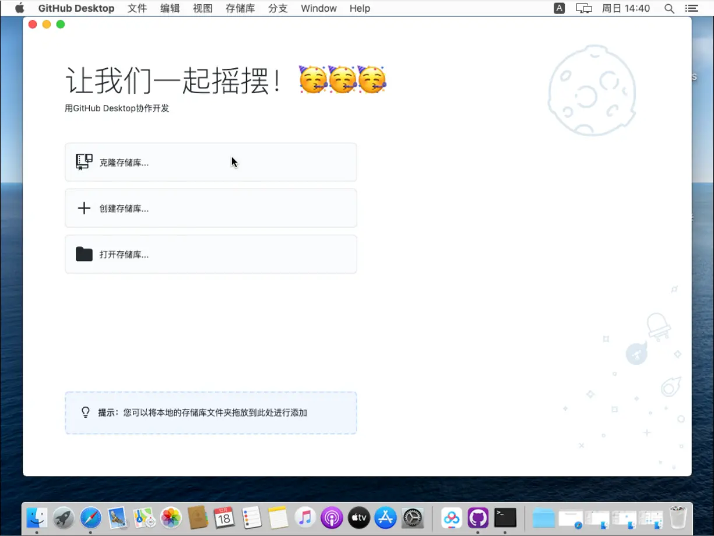
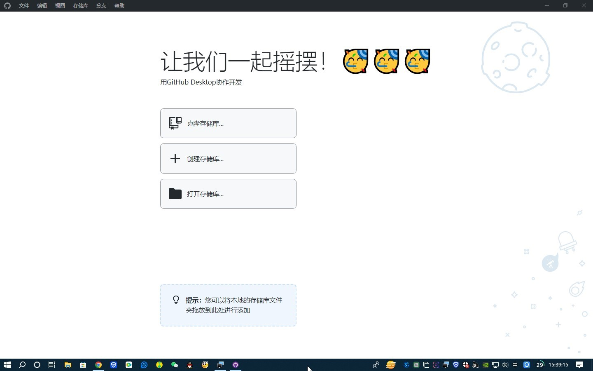

# GitHub_Desktop_Simplified_Chinese

---

<b>GitHub Desktop</b>

<b>专注于重要的事情，而不是与Git斗争。无论您是Git新手还是经验丰富的用户，GitHub Desktop都可以简化您的开发工作流程。</b>

 

---

GitHub Desktop 官网：https://desktop.github.com

GitHub Desktop 仓库：https://github.com/desktop/desktop

GitHub Desktop 发行版：https://github.com/desktop/desktop/releases/latest

GitHub Desktop 发行说明：https://desktop.github.com/release-notes

GitHub Desktop 客户端官网下载：| [Linux](https://github.com/shiftkey/desktop/releases/latest) | [MacOS](https://central.github.com/deployments/desktop/desktop/latest/darwin) | [Windows](https://central.github.com/deployments/desktop/desktop/latest/win32) | 

GitHub Desktop 客户端Releases下载：| [Linux](https://github.com/shiftkey/desktop/releases/latest) | [MacOS](https://github.com/desktop/desktop/releases/latest/download/GitHub.Desktop-x64.zip) | [Windows](https://github.com/desktop/desktop/releases/latest/download/GitHubDesktopSetup-x64.exe) | 

GitHub Desktop 版本：| 3.5.0 - 3.6.3 | 

GitHub Desktop 汉化补丁包 版本：| 3.5.0 - 3.6.3 | 

---

# 注意：

请一定要保持Github Desktop版本与本汉化补丁包版本对应，否则汉化后Github Desktop可能会报错或打不开。

---

# GitHub Desktop for 2026年07月17日 3.6.3 发布说明

**固定的**
- 修复了导致基于 Copilot 的功能在 Windows 上无法正常工作的错误 - [#22509](https://github.com/desktop/desktop/pull/22509)
- 阻止在输入类似“null”这样的查询时，@提及自动完成功能显示没有个人资料名称的用户 - [#22414](https://github.com/desktop/desktop/pull/22414)。谢谢。[@sukanth](https://github.com/sukanth)！
- 修复了截断仓库路径文本可能导致无限重新渲染循环的崩溃问题 - [#22458](https://github.com/desktop/desktop/pull/22458)
- 回退到主工作树，这样当链接的工作树文件夹在桌面外部被删除时，存储库就不会再显示为丢失 - [#22474](https://github.com/desktop/desktop/pull/22474)
- 桌面从后台返回后，保持文件在“更改”列表中可见 - [#22497](https://github.com/desktop/desktop/pull/22497)
- 当 Copilot 由于 Git 错误而无法生成提交消息时，应显示错误对话框，而不是静默执行任何操作 - [#22496](https://github.com/desktop/desktop/pull/22496)
- Copilot 会话（例如生成提交消息或解决冲突）不会显示在 VS Code 中 - [#22443](https://github.com/desktop/desktop/pull/22443)
- 仓库列表滚动不再出现卡顿或抖动，尤其是在滚动浏览大型组织（例如大型机构）时 - [#22438](https://github.com/desktop/desktop/pull/22438)。谢谢。[@peteski22](https://github.com/peteski22)！

**改进**
- 请澄清行尾转换警告，说明 Git 会在下次检出时自动转换文件的行尾，并提供一个链接以了解更多信息 - [#21446](https://github.com/desktop/desktop/pull/21446)。谢谢。[@Whitebrim](https://github.com/Whitebrim)！

---

# Linux 简体中文汉化

将本仓库中Linux文件夹下的main.js和renderer.js拷贝粘贴替换本地GitHub Desktop的资源目录

本地GitHub Desktop资源目录一般为：/usr/lib/github-desktop/resources/app
     【请一定记得提前做好备份】
     
替换完成后 重新打开GitHub Desktop

完成后界面
---

---

# MacOS 简体中文汉化

将本仓库中Mac文件夹下的main.js和renderer.js拷贝粘贴替换本地GitHub Desktop的资源目录

本地GitHub Desktop资源目录一般为：/Applications/GitHub Desktop.app/Contents/Resources/app
     【请一定记得提前做好备份】
     
替换完成后 重新打开GitHub Desktop

完成后界面
---

---

# Windows 简体中文汉化

将本仓库中Windows文件夹下的main.js和renderer.js拷贝粘贴替换本地GitHub Desktop的资源目录

本地GitHub Desktop资源目录一般为：C:\Users\【用户名】\AppData\Local\GitHub Desktop\【最新版本文件夹 例：app-3.6.3】\resources\app
     【请一定记得提前做好备份】
     
替换完成后 重新打开GitHub Desktop

完成后界面
---

---

### 如果您觉得本工具对您有帮助，不妨在右上角点亮一颗小星星，以示鼓励！

---

  

  

  

  

  

---

昵称：我只是你的过客

个性签名：每个人都是每个人的过客

国籍：中华人民共和国 / 现居：中国湖北省武汉市

---

[MIT License](https://github.com/743859910/GitHub_Desktop_Simplified_Chinese/blob/master/LICENSE)

Copyright © 2008 - 2026 743859910. All Rights Reserved. 我只是你的过客工作室. 版权所有

---
